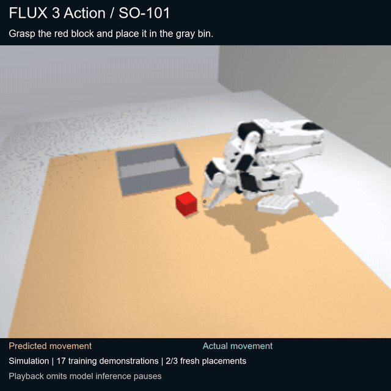
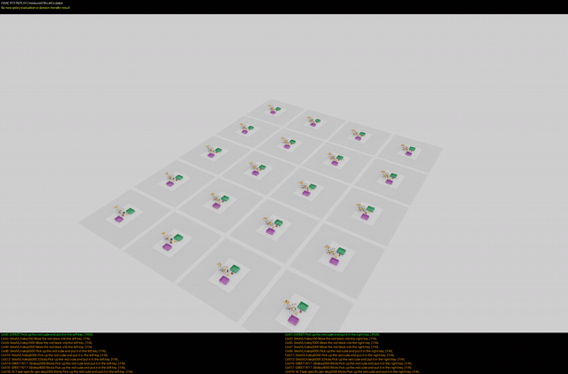
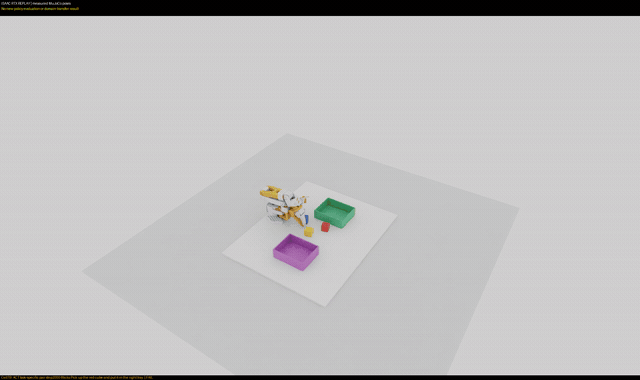
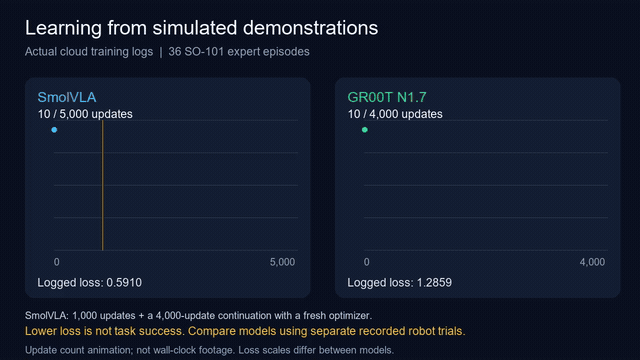

# SO-101 robotics lab: LeRobot and FLUX

A small robotics lab testing how learned models control a simulated SO-101 arm. It retains official LeRobot ACT experiments and a FLUX model trained to follow a simple pick-and-place instruction. Watch the [interactive viewer](https://lokensi.github.io/lerobot-so101-lab/), including the paired success/failure comparison and every failed rollout.

The prior final assessment completed **2/5** starts. A later exploratory check completed **10/12** rollouts: three paired starts in four visual conditions, rather than twelve independent starts. These results use the same frozen checkpoint and strict grader; the later check does not replace the earlier assessment. All results are simulation. No physical SO-101 or Orin performance is claimed.

ACT receives two actual 96×96 RGB observations and six joint values. It predicts sixteen absolute joint targets and executes eight before replanning. Amber overlays show forward kinematics of predicted joint targets; cyan shows observed TCP motion. The overlays replay saved states and update every eight simulated control ticks, rather than presenting a hardware feed or a validated future trajectory.

## Watch the videos

Click an animated preview to open the full MP4. The FLUX teaser shows the earlier learned simulation experiment; native overview and closeup show measured-pose replay with physics disabled. The harder three-model placement comparison has 0/6 successes; every failure remains available in the office viewer.

**FLUX learned pick and place**

[](site/flux-adapted/teaser/flux-teaser.mp4)

[Watch full MP4](site/flux-adapted/teaser/flux-teaser.mp4)

**Native overview: measured-pose replay**

[](site/office-training/media/native-legible-overview.mp4)

[Watch full MP4](site/office-training/media/native-legible-overview.mp4)

**Native closeup: measured-pose replay**

[](site/office-training/media/native-legible-closeup.mp4)

[Watch full MP4](site/office-training/media/native-legible-closeup.mp4)

**Actual training-loss measurements**

[](site/office-training/media/training-loss.mp4)

[Watch full MP4](site/office-training/media/training-loss.mp4)

## Calibrated virtual stereo follow-up

The [stereo viewer](https://lokensi.github.io/lerobot-so101-lab/stereo/) adds a generic 60 mm stereo RGB pair and marked-object localization. A frozen scripted contact baseline passed **4/4** nominal/shifted trials. Two separate perception negatives rejected localization and stopped before grasp motion. Five calibration probes had a maximum 1.425 mm 3D localization error.

This uses an initial RGB-derived XY estimate, fixed grasp height and a known tray location. It is separate from the learned ACT results above. The video shows actual stereo images, fresh measurements, observed TCP and scripted targets. Read the [method](docs/stereo-method.md), [frozen results](runs/so101-stereo-v1/report.json), [independent audit](runs/so101-stereo-v1/independent-verification.json) and [retained setup failure](experiment/stereo-setup-failure/execution.log). Full saved RGB/state trajectories are included in this checkout through Git LFS; the earlier tagged release remains the original ACT bundle.

## FLUX 3 Action: local pretrained retry

The [FLUX viewer](https://lokensi.github.io/lerobot-so101-lab/flux-retry/) preserves two complete development trials, including every failed action chunk. The original pretrained SO101 checkpoint ran locally on a 16 GB RTX 5070 Ti using BF16 CPU offload: **0/2 placements succeeded**. The first prediction took 17.3 seconds; subsequent predictions were typically about 4.1 seconds. The simulated 30 Hz footage pauses inference between chunks; this is not real-time AI control.

One adapter uses the hosted demo's published median statistics. The other is a geometry-supported legacy calibration hypothesis with unknown dataset motor offsets; it clipped 400 commands and did not establish a valid calibration. No additional training was used for these two trials. FLUX receives scene/wrist RGB, measured joints, previous issued commands and a text instruction; object coordinates are reserved for reset and grading.

Read the [method](docs/flux-so101-retry-method.md), [reproduction](docs/flux-so101-retry-reproduction.md), [frozen run](runs/flux-so101-retry/dev-v1/frozen-specification.json), [independent CPU audit](runs/flux-so101-retry/dev-v1/independent-cpu-audit.json), and [original source inventory](experiment/flux-so101-retry/source-inventory.json). All 48 input windows, 48 action arrays and both full trajectories are included, with large camera arrays and videos in Git LFS. The original 13.9 GB checkpoint and shared encoders are fetched separately from pinned upstream revisions. The later trained adaptation is documented below as a separate experiment.

## FLUX learned our simulated task

After the original pretrained model completed **0/2** placements, we trained the real FLUX 3 Action SO101 model using **17 demonstrations**, with three other demonstrations reserved for validation. The selected model completed **2/3 fresh simulated starts** after 256 training updates. All three independent evidence audits passed. The third trial grasped and carried the block but did not release it within the fixed run.

The instruction was **“Grasp the red block and place it in the gray bin.”** FLUX receives two camera views, measured joints and previous commands, then predicts the next movements. During these tests it received no object coordinates or scripted pickup correction. Watch the [FLUX videos and all outcomes](https://lokensi.github.io/lerobot-so101-lab/flux-adapted/), including the failures and overlays of predicted and actual movement.

This is a small, same-task simulation experiment. Median warm prediction time was 4.58 seconds for 1.07 seconds of simulated commands; playback excludes inference pauses. Physical SO101 and Orin deployment remain untested. Original demonstrations, training data, adapters, optimizer state, model inputs/actions and independent audits are retained through Git LFS. See the [training recipe](docs/flux-adaptation-reproduction.md), [frozen selection](runs/flux-so101-retry/selected-adapter-0256-cfg3.json) and [source inventory](experiment/flux-so101-adaptation/source-inventory.json). The earlier ACT and stereo experiments remain separate.

## Office training and controlled comparisons

The [office training viewer](https://lokensi.github.io/lerobot-so101-lab/office-training/) adds actual SmolVLA, GR00T and ACT development clips, training-loss records, full action traces and retained failures. Paired tests use the same A100 inference hardware and local CPU physics; synchronized server timing is separate from SSH and rendering pauses. ACT uses an explicit task router. Native Isaac clips replay measured MuJoCo poses with physics disabled. Read [the reproduction guide](docs/office-training-reproduction.md) and the viewer provenance for exact checkpoint, training scope and outcome details. The current harder paired model placements measured **0/6 physical successes** in each complete three-model comparison; the gallery retains all 36 completed clips, including failures. Native clips are **pose replay, not learned PhysX evaluation**.

[Native overview MP4](site/office-training/media/native-legible-overview.mp4) · [Native closeup MP4](site/office-training/media/native-legible-closeup.mp4) · [Measured training-loss MP4](site/office-training/media/training-loss.mp4) · [All checkpoint rollout videos](https://lokensi.github.io/lerobot-so101-lab/office-training/).

These tests do not replace the earlier ACT, FLUX or stereo results, and no new physical hardware result is claimed.

## Read the evidence

- [Measured results and every grader outcome](experiment/measured-results.json)
- [Experiment roles and seed boundaries](experiment/experiment-roles.json)
- [Reproduce generation, training, evaluation and replay](docs/reproduction.md)
- [Overlay semantics and verification](docs/overlays.md)
- [Script inventory and original hashes](experiment/source-inventory.json)
- [Pinned upstream source and asset hashes](experiment/upstream-source-lock.json)
- [Upstream attribution and license evidence](THIRD_PARTY_NOTICES.md)

The desktop measurements used an RTX 5070 Ti, Ubuntu 24.04 under WSL2, Python 3.12.3, PyTorch 2.10.0+cu128 and MuJoCo 3.6.0. Inference timings describe that experiment's precision and measurement boundaries; they are not a guarantee of physical control frequency.

## Retrieve the complete experiment

The source checkout and public viewer keep the experiment bundle separate from model weights and optimizer state. Download the release assets with the GitHub CLI:

```sh
gh release download experiment-2026-10-02 --repo LokenSI/lerobot-so101-lab \
  --pattern lerobot-experiments-2026-10-02.zip \
  --pattern lerobot-archive-manifest.json \
  --pattern lerobot-diagnostics-2026-10-02.zip \
  --pattern lerobot-diagnostics-manifest.json --dir downloads
python -m zipfile -e downloads/lerobot-experiments-2026-10-02.zip .
```

The ZIP retains the original `runs/` paths: scripted demonstrations, three training runs and optimizer states, development and prior final evaluations, all twelve robustness rollouts, saved observations and trajectories, the reference replay, overlay provenance and the future Orin inference pack. Compare checksums with `lerobot-archive-manifest.json`. Original report paths may identify the experiment's original checkout; they are retained as provenance and may need relocation for replay diagnostics.

The separate `lerobot-diagnostics-2026-10-02.zip` and `lerobot-diagnostics-manifest.json` preserve experiment logs and the earlier failed hosted **FLUX 3 Action / SO-101** comparison evidence. That comparison used a different model and service; it is separate from the local LeRobot ACT outcomes and success counts.

If cloning the viewer assets locally, install Git LFS and run `git lfs pull` before opening or serving `site/`. Source and presentation changes are recorded independently; the experiment runner, environment and grader copies retain their original bytes.

## Bootstrap the measured desktop environment

Run these commands from the repository root inside Ubuntu 24.04/WSL with Python 3.12, a suitable NVIDIA driver and EGL available:

```sh
python3.12 scripts/bootstrap_runtime.py --install
export MUJOCO_GL=egl PYOPENGL_PLATFORM=egl
runtime/lerobot-teaser-env/bin/python scripts/verify_lerobot_act_runtime.py
```

Bootstrap downloads official LeRobot at `6e1fa4faf2a42927d463591aebaa0f62c2e654b7` and the SO-101 Space's selected simulator/model/assets at `d7da38e032da0e136d6de21c218dc616982a8cc9`, then verifies their recorded hashes. The pinned Space has no general code license declaration, so its runtime is fetched directly from upstream rather than redistributed here. No virtualenv, third-party runtime, meshes or font files are vendored.

To evaluate the released checkpoint without overwriting recorded results:

```sh
runtime/lerobot-teaser-env/bin/python scripts/evaluate_lerobot_teaser.py \
  --checkpoint runs/lerobot-teaser/train-8000 --environment-module so101_pick_place_baseline \
  --seeds 300 301 302 303 304 --output runs/reproduction/final
runtime/lerobot-teaser-env/bin/python scripts/run_lerobot_cases.py \
  --checkpoint runs/lerobot-teaser/train-8000 --output runs/reproduction/cases
runtime/flux-action-sim-env/bin/python scripts/render_lerobot_overlays.py \
  --suite runs/reproduction/cases --width 1440
```

The policy requirements are a measured **desktop x86_64** lock. A later Orin replay needs the Jetson's supported Arm64/JetPack/PyTorch stack; use `benchmark_lerobot_act_replay.py` with a saved observation and report the device's own measurements. That replay issues no robot commands and is separate from closed-loop task success.
